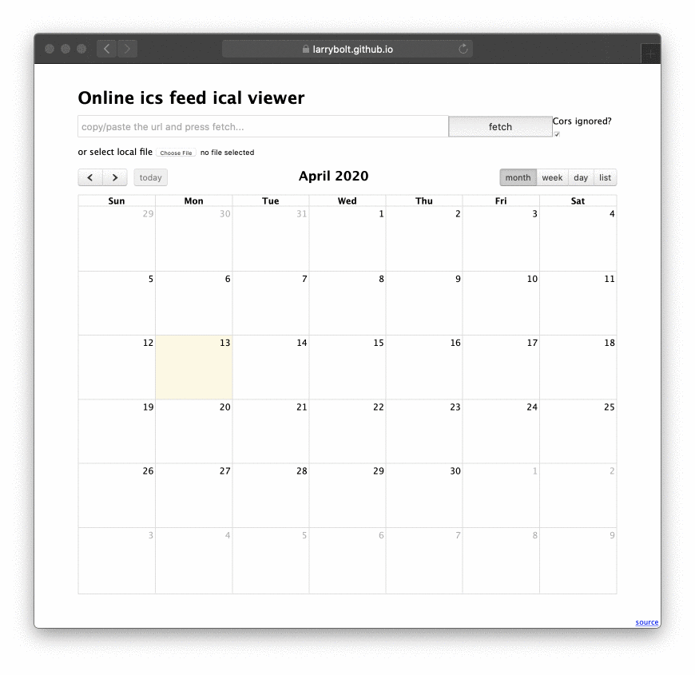

# Online ICS feed viewer

[online](https://larrybolt.github.io/online-ics-feed-viewer/)

You can use this to either view quickly the contents of a ics file, or a ics feed online, or to make a public ics feed or local file viewable trough an url.

## Why
I can't believe this doesn't exists... I just want this, nothing more. I just don't want to download / import to view something online. 
    Time it took to make, aka combine two <a href="https://fullcalendar.io/">existing</a> <a href="https://github.com/mozilla-comm/ical.js">javascript</a> libraries: 2h 
    result: something super usefull if you need it. If you need feature-x or it doesn't works, just open an <a href="https://github.com/larrybolt/online-ics-feed-viewer/issues">issue</a>.